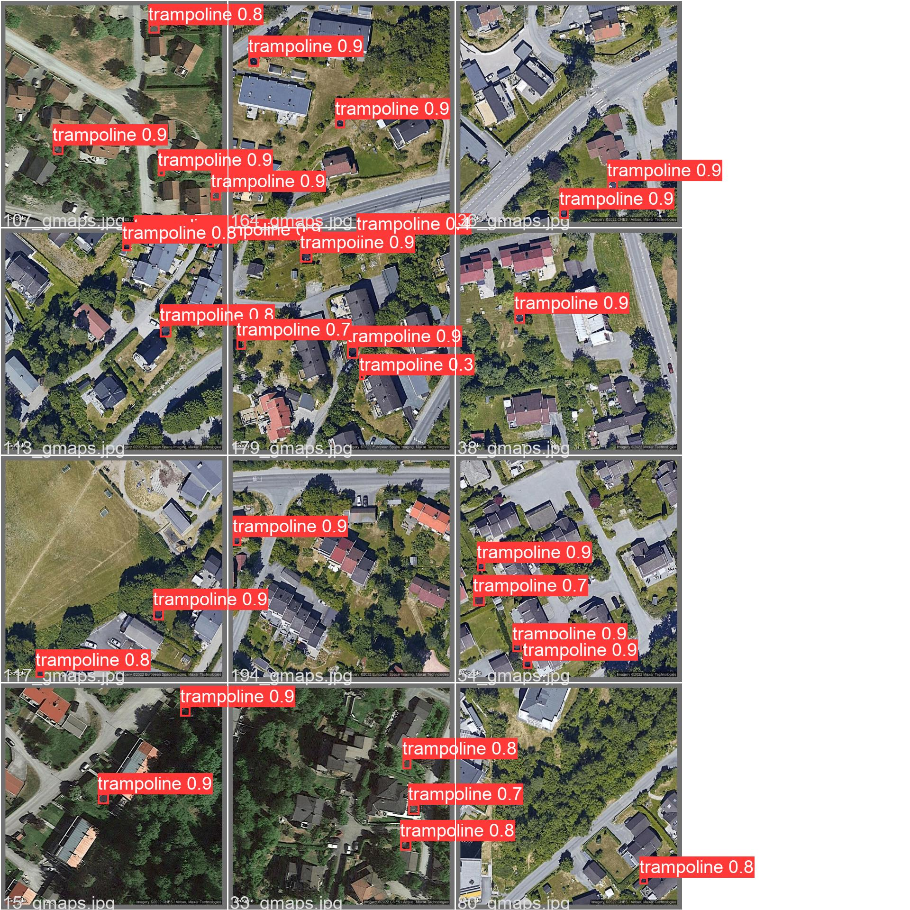
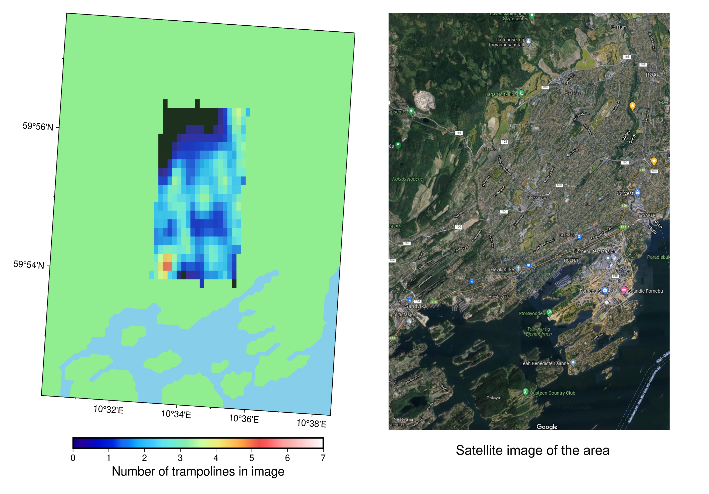

# Trampoline detection using YOLOv5
## Background

Walking around Oslo, you can see many gardens with trampolines - but how many? 

This repo contains:
* Code to get satellite images from Google Maps using the Static Maps API
* Instructions to:
    - label the data
    - Prepare the data for YOLOv5
    - Train the model and make predictions
* Visualisation and mapping of the model predictions using PyGMT

Results of the prediction are the coordinates of bounding boxes around the trampolines in the satellite images, as below.


## To do

* Finalise making maps of trampoline density across Oslo
* Add more analysis of model training metrics

## Resources

Train custom object detection model with YOLO V5 - Abhishek Thakur
https://www.youtube.com/watch?v=NU9Xr_NYslo

## Installation

1. Install the requirements in requirements.txt, which has been adapted from the YOLOv5 requirements file. I used a conda environment (called yolo5env) with Python 3.9, and then pip for all required packages, as below:

    ```
    conda create -n yolo5env python=3.9
    conda activate yolo5env
    pip install -r requirements.txt
    ```

    The requirements file specifies cuda version cu101, as I found issues when using cu102. I haven't tried any newer versions of the cuda package.

2. Clone Yolov5 from https://github.com/ultralytics/yolov5 into subfolder of this project called `/yolov5.`

## Getting the satellite image data

Image data is loaded from Google static maps API using `get_images.py`.

This script requires an API Key which is stored in `api_key.env` text file containing one line(you need to make this yourself using the Google developer portal - this is free of charge):

    API_KEY = "YOUR_KEY_HERE"
    
`get_images.py` will save the images in `/images` alongside a csv text file containing the image number and the longitude, latitude, and zoom level given to the API.

`coordinates_calculation.ipynb` is used to calculate the `spacing_long` and `spacing_lat` parameters `get_images.py` which determine the spacing between consecutive satellite images. These are measures of longitude and lattitude so that images neither overlap or have gaps between them. These values depend on the location, the zoom level, and the size of the image in pixels.

## Labelling the data

I used https://github.com/tzutalin/labelImg to label the data according to the YOLO formatting standard.

For this, I first cloned the repository and installed the dependencies into a *separate, clean environment* used only for labelling images. 

Activate the labelling environment and from the repository folder, run `python .\labelImg.py` 

To start labelling, I opened the folder containing the images (`/images` in this case), changed type to YOLO, and used autosave and single class mode ('trampolines') to go faster and minimise mouse-clicks.

For YOLO, images need to be split into train and validation sets using the file structure below. `/labels` contains only text files as produced from labelImg, and `/images` contains only the images. If you follow create the folders as per the below structure, then the `split_data.py` script will perform a train-test-split taking the data in `/images` and putting in the correct folders of `/data` for you.

    ├───data

        ├───images

            ├───train

            └───validation
        └───labels

            ├───train

            └───validation
    ├───yolov5
        ├───models
            ├───trampolines.yaml

    ├───images


* `/images` contains images and their labels
* `/data` contains all the data for training and validation
* `/yolov5` contains the cloned YOLOv5 repo

## Training 

Copy the `trampolines.yaml`, containing parameters for the model, into the `/yolov5/data/` folder. Here I use the the yolov5 small model. This file also contains the relative filepaths of the training and validation images.

First `cd` to the the `/yolov5` directory and run

    python .\train.py --img 640 --batch 32 --epochs 200 --data data/trampolines.yaml --cfg models\yolov5s.yaml --name tm

The trained model and metrics will be saved to `/yolov5/runs/train` in a folder named `tmX` with `X` incrementing by 1 each time.

## Testing

From the `/yolov5` directory, run the following, with the weights folder you want to use (below it looks for the best set of weights in `/tmX` - you'll need to change this folder accordingly where `X` is the number of the particular trained model):

    python .\detect.py --source ../images/data_2022-02-13_Oslo_Center --weights runs/train/tmX/weights/best.pt --save-txt --data data/trampolines.yaml

The classified images will be will be saved to `/yolov5/runs/detect`

The `--save-txt` tag is required to get the coordinates (normalised to the image dimensions) of the trampolines within each image. A file is generated for each image, and each contains as many lines as there are trampolines detected within the image.

## Visualisation

Finally, `visualisation.ipynb` plots both the data from the manually-labelled test-train set (below), and the data predicted by the model across the Oslo area.



